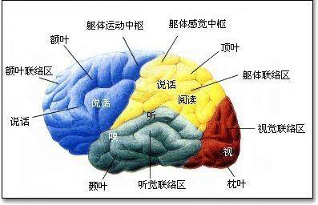
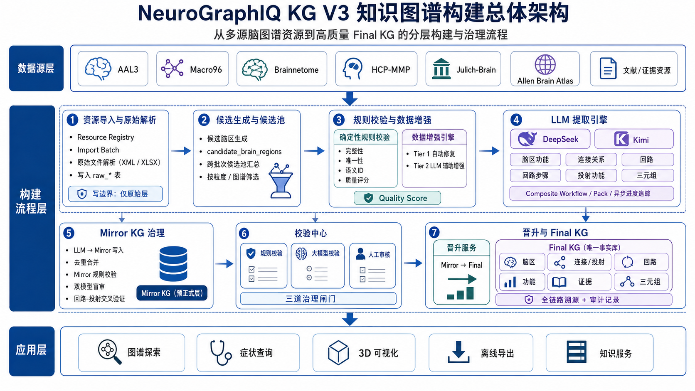
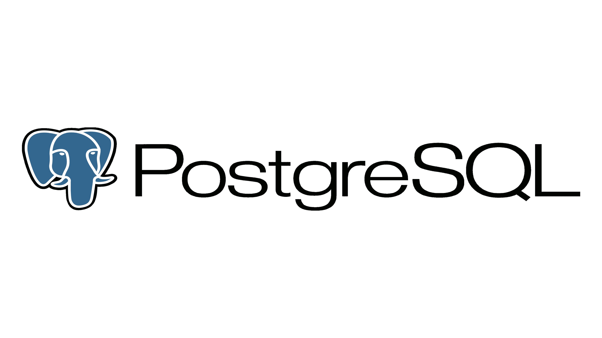

# source_deck

- Source: `source_deck.pptx`
- Total slides: 18

## Slide 1

NeuroGraphIQ KG V3

多粒度脑区知识图谱构建过程学术汇报

汇报人：[请填写姓名]

日期：2026年8月3日

### Speaker Notes

1.7.2013

大家好，今天我将向各位汇报NeuroGraphIQ KG V3项目，一个专注于构建多粒度脑区知识图谱的系统。本次汇报将详细介绍我们的设计理念、构建流程、技术架构以及最终实现的功能。希望通过这次分享，能让大家对我们如何从多源异构数据出发，构建一个高质量、可追溯的知识图谱有一个全面的了解。

‹#›

## Slide 2

目录 CONTENTS

01

02

03

项目概述与设计理念

知识体系与构建流水线

构建流程详解

明确项目的核心定位与建设目标，深度解析支撑系统高效构建的九大核心设计原则，奠定坚实基础。

解构专业领域的七层知识体系模型，详解从知识生产、抽取到融合的五阶段漏斗式构建流水线全貌。

分步拆解从多源异构资源导入、智能知识抽取与融合、到人工审核校验与知识自动晋升的全流程细节。

04

05

知识消费与全链路溯源

技术架构与工程规模

探索知识图谱在智能问答、精准推荐、决策支持等场景的应用模式，解析从知识源头采集到终端应用的全链路可追溯机制，确保数据来源清晰、可信可控。

展示高可用、高扩展性的分布式系统技术架构，呈现当前知识图谱的实体规模、关系数量、数据存储量级及系统并发处理能力等核心工程指标。

### Speaker Notes

1.7.2013

本次汇报将分为五个部分。首先，我会介绍项目的整体定位和核心设计理念。接着，将详细阐述我们设计的七层知识模型和五阶段构建流水线。第三部分是本次汇报的重点，我会一步步拆解知识图谱的构建流程。之后，会展示知识图谱的应用场景和我们设计的全链路溯源体系。最后，介绍项目的技术架构和工程规模。

‹#›

## Slide 3

01 项目概述与设计理念

核心目标：构建多粒度脑区知识图谱

突破传统图谱的单一维度限制，打造具备多维度、跨尺度、高关联度的脑科学知识基础设施，实现从宏观解剖到微观机制的全尺度知识关联。

核心任务：全链路知识构建与治理

通过“资源汇聚→LLM辅助提取→Mirror KG中转→人工审核”的闭环流程，确保产出结构化存储、全链路可追溯、动态可迭代的高质量脑区知识资产。

项目以神经影像与解剖学为基础，旨在打破传统单一数据源的壁垒。通过对不同尺度脑区数据的融合与关联，构建一个能够反映大脑结构与功能复杂性的智能化知识库，为脑科学研究与临床应用提供坚实的数据支撑。

数据架构：五级粒度的层级化扩展

覆盖宏观临床、中观解剖、亚区连接、细胞构筑、分子属性五大层级；已完成AAL3、Macro96等宏观图谱的标准化接入，预留接口支持未来多尺度数据的无缝扩展。

### Speaker Notes

1.7.2013

首先来看第一部分，项目概述与设计理念。我们的项目名为NeuroGraphIQ KG V3，核心目标是构建一个多粒度的脑区知识图谱。我们的任务是整合多种来源的脑图谱数据，通过一套严谨的流程，最终生成一个结构化、可追溯且易于探索的高质量知识图谱。目前，我们已经成功实现了宏观临床层的数据整合，并为未来更精细的粒度层级预留了接口。

‹#›

## Slide 4

01 项目概述与设计理念

为确保知识图谱的质量、可靠性与可维护性，项目确立九大核心硬约束原则，构建严谨的数据治理体系，从源头规避风险，保障系统稳健运行。

01. LLM 安全隔离

02. 统一接入入口

03. 强制双重审核

严格隔离生成式内容，仅写入临时表（llm_extraction_*），严禁未经审核直接写入 final_* 正式库，从机制上规避生成幻觉带来的数据污染风险。

所有外部数据资源必须经由 file_registry 注册，流转至 import_tasks 任务调度与 staging_* 中间层，实现来源标准化管控，杜绝数据随意接入。

规则引擎自动校验逻辑一致性与格式合规性，结合人工专家复核形成双重关卡。无完整审核记录的数据严禁进入下一环节，保障入库质量。

04. 正式库绝对纯净

05. 全链路溯源体系

final_* 表族仅承载通过全流程审核的可信数据，作为知识图谱对外提供查询、推理服务的唯一基准，从源头杜绝脏数据、错误关联对业务应用的影响。

全生命周期记录 source_atlas（来源图谱）、source_version（版本）、import_batch_id（批次）等关键元数据，实现每一条三元组的来源可查、版本可控、变更可追溯，满足审计与回溯需求。

### Speaker Notes

1.7.2013

为了保证图谱的质量，我们制定了九大硬性设计原则。首先是前五个原则：第一，LLM安全隔离，确保AI生成的内容不会直接进入正式库，必须经过审核。第二，统一入口，所有数据都必须通过指定流程进入系统。第三，强制审核，任何数据都必须经过机器和人工的双重校验。第四，保证正式库的纯净，只有通过所有审核的数据才能进入。第五，全链路可追溯，确保每一条知识都有源可查。

‹#›

## Slide 5

01 项目概述与设计理念

06

07

粒度隔离

显式映射

在数据库层面对不同粒度数据进行Schema物理隔离，前端路由同步实施对应层级隔离，从底层架构上杜绝跨粒度数据干扰，确保数据边界清晰可控。

跨粒度关联关系必须通过专用mapping表进行显式建模与持久化，严禁依赖字符串相似度进行隐式合并，确保数据关联逻辑透明、可追溯且无歧义。

08

09

LLM输出标记

全程日志记录

完整留存大模型的原始响应（raw_response），并自动将其写入审核队列（review_queue），建立AI生成内容的全量留痕机制，保障输出内容可复核、可追溯。

依托quality_reports、promotion_log及系统日志，全链路记录数据处理、模型调用、权限变更等关键操作，实现操作过程透明化，满足系统审计与安全合规要求。

### Speaker Notes

1.7.2013

接下来是后四个原则：第六，粒度隔离，确保不同层级的数据不会混淆。第七，显式映射，所有跨图谱的关系都必须明确定义，杜绝模糊匹配。第八，LLM输出标记，完整记录AI的原始输出，便于审核和追溯。最后，全程日志记录，系统会记录所有关键操作，确保整个流程的透明和可审计。这些原则共同构成了我们系统的坚实基础。

‹#›

## Slide 6

02 知识体系与构建流水线

01脑区实体层

02连接层

03回路层

04功能层

作为图谱的基础节点层，统一存储来自AAL3、Macro96等经典脑图谱的标准化脑区实体，确立空间定位基准。

定义脑区间的多元关系网络，涵盖解剖结构连接、功能协同关联以及病理状态下的因果效应连接。

表征由多脑区构成的有序神经回路，体现脑网络的动态协作模式，是解析复杂神经机制的功能单元。

建立神经结构与认知功能的映射桥梁，将语言、记忆、情感等高级功能术语精准关联至具体脑区与回路。

05证据层

06三元组层

07映射层

为每一条非平凡知识声明绑定权威文献来源、实验证据文本及专家审核记录，从源头保障图谱的科学性、可溯源性与可信度。

采用标准化的SPO（Subject-Predicate-Object）数据结构，提供统一的语义查询接口，支持高效的图检索、关联分析与自动化推理计算。

显式存储跨脑图谱、跨空间粒度的脑区映射与对齐关系，解决多源异构数据的融合难题，实现不同尺度研究成果的互联互通。

### Speaker Notes

1.7.2013

现在进入第二部分，知识体系与构建流水线。我们设计的最终知识图谱是一个七层结构。从底层的脑区实体，到连接层、回路层，再到功能层，每一层都构建在前一层的基础上。特别地，我们设计了证据层来保证知识的可信度，三元组层提供统一的查询接口，以及映射层来处理跨图谱的关系。这个七层模型构成了我们知识组织的核心框架。

‹#›

## Slide 7

02 知识体系与构建流水线

知识图谱的构建遵循“数据收敛、质量跃升”的五阶段漏斗模型，从多源异构数据的接入，到层层校验与增强，最终沉淀为高置信度的结构化知识网络，支撑上层智能应用。

- 01 多源异构导入与解析
- 整合文献、数据库、临床记录等多模态数据，通过标准化解析器完成格式归一化，构建统一的原始数据池，实现海量信息的初步汇聚。

- 02 智能校验与LLM增强
- 引入规则引擎与大模型双轨校验，自动识别冲突；利用LLM进行实体链接、关系补全与属性增强，大幅提升图谱的完整性与准确性。

- 03 全链路治理与质量闭环
- 建立“人工审核+自动回溯”的治理体系，对图谱进行动态更新与质量评估，形成“构建-校验-优化”的可持续知识进化闭环。

构建流水线不仅是数据的加工过程，更是知识从无序到有序、从低质到高质的智能进化引擎。

### Speaker Notes

1.7.2013

我们的构建流程可以概括为一个五阶段的漏斗模型。这张图直观地展示了整个过程：从左侧的数据源导入，经过中间的构建流程层，最终到达右侧的应用层。数据在这个过程中，经历了导入解析、候选生成、校验增强、LLM提取和审核晋升五个阶段，每一步都旨在提升数据的质量和结构化程度，最终形成高质量的知识图谱。

‹#›

## Slide 8

02 知识体系与构建流水线

01

02

03

04

05

导入解析

候选生成

校验增强

LLM提取

审核晋升

Import & Parse

Candidate Gen

Validate & Enhance

LLM Extract

Review & Promote

输入：XML/Excel 原始脑图谱文件 输出：结构化原始数据表 核心：插件化解析架构，实现多源异构数据的高效兼容与接入。

输入：解析后的原始数据 输出：标准化候选脑区记录 核心：统一数据结构与字段定义，为后续处理建立标准的数据入口。

输入：标准化候选数据 输出：清洗增强后的高优数据 核心：结合确定性规则清洗与LLM智能纠错，大幅提升数据质量。

输入：增强后的高质量数据 输出：镜像知识图谱(Mirror KG) 核心：利用大模型深度挖掘并提取脑区间的隐含语义与复杂关联。

输入：Mirror KG 知识单元 输出：最终验证图谱(Final KG) 核心：人机协同的审核与晋升机制，保障图谱知识的准确性与权威性。

流水线构建了从原始数据到可信知识的完整闭环，通过“自动化处理+人工把关”确保了知识图谱的高质量与可用性。

### Speaker Notes

1.7.2013

让我们详细看一下这五个阶段。第一阶段是导入解析，将原始文件转化为结构化数据。第二阶段是候选生成，将数据标准化。第三阶段是校验增强，通过规则和AI提升数据质量。第四阶段是LLM提取，利用大模型来发现脑区间的复杂关系，并将结果存入Mirror KG。最后，第五阶段是审核晋升，通过人工审核，将Mirror KG中的高质量知识提升到最终的知识图谱中。

‹#›

## Slide 9

03 构建流程详解

阶段一 & 二：资源导入、解析与候选生成

01 资源统一登记

02 双轨文件管控

03 批次化全流程审计

对所有接入的脑图谱资源进行元信息注册，记录名称、版本号、空间粒度等关键属性，为全流程数据溯源建立不可变的资源身份基准。

严格分离“权威源文件”与“工作区文件”，实现原始数据的只读归档与临时处理文件的隔离存储，确保原始资产的安全与版本可控。

以“导入批次”为核心单元，记录操作人、时间及数据状态，支持导入预览、执行与异常回滚，形成完整的操作审计日志，保障数据变更可追溯。

04 单向异构原始解析

05 溯源化候选脑区生成

利用专用解析器将NIfTI、JSON等异构原始文件转化为结构化数据，严格遵循“只写原始表”的单向原则，杜绝反向污染，从底层保障数据处理的可靠性与清洁度。

将解析后的原始数据清洗映射为标准化的“候选脑区记录”，每条记录均关联源资源、批次及文件信息，构建完整的溯源链条，为后续的脑区智能匹配与融合计算奠定统一的数据基础。

### Speaker Notes

1.7.2013

第三部分，我们将深入细节，逐一解析构建流程。首先是阶段一和二：资源导入、解析与候选生成。这个过程的核心是确保数据来源的清晰和可追溯。所有资源都需要先注册，然后通过导入批次进行管理。解析器将原始文件转换为结构化数据，但只写入原始表，保证了数据处理的单向性。最后，候选生成步骤将这些数据标准化，为后续处理做好准备。

‹#›

## Slide 10

03 构建流程详解

阶段三：规则校验与数据增强体系

01 前置规则硬校验

02 多维质量评分 (0-100)

基于12条确定性规则进行“熔断式”筛查，重点核验字段完整性、语义ID合法性与唯一性。一旦检出BLOCKER级错误，系统将直接阻断流程，从源头规避低质数据进入下游处理环节。

构建包含完整性、溯源性、拓扑正确性等维度的量化评估模型，自动为每条数据生成质量分。评分结果作为数据分级、是否触发增强及人工介入的核心决策依据。

Tier 1 · 自动化确定性修复

Tier 2 · LLM 深度智能增强

针对标准化缺失、格式不规范等结构化问题，通过规则引擎进行毫秒级自动修复，无需调用大模型。可高效解决80%以上的基础数据缺陷，显著降低算力消耗与处理成本。

针对模糊语义、逻辑冲突等复杂场景，调用DeepSeek等大模型进行推理补全与内容优化，生成结构化的增强建议。结果需经人工复核确认，确保增强内容的准确性与业务合理性。

### Speaker Notes

1.7.2013

接下来是阶段三：规则校验与数据增强。在这一步，我们首先用12条确定性规则对数据进行严格检查，任何严重错误都会被拦截。通过校验的数据会获得一个质量评分。然后，数据增强引擎会介入，分为两个层级：Tier 1是确定性修复，自动修正一些格式问题；Tier 2则会调用LLM来处理更复杂的问题，并提出增强建议，供人工审核。

‹#›

## Slide 11

03 构建流程详解

01 双LLM架构设计

02 七层知识关系提取

基于Provider抽象层实现多后端灵活切换，兼容DeepSeek、Kimi等主流模型。内置全链路调用日志记录，支持运行时动态负载与模型热切换，保障知识提取任务的高可用性与可追溯性。

从候选脑区出发，逐层解析并提取七类核心知识：连接关系、功能定位、回路构成、投射功能、回路功能、回路步骤及三元组整合，实现从微观神经连接到宏观脑区功能的全维度知识解构。

03 异步编排工作流引擎

04 Mirror KG 预治理层

将多阶段提取任务编排为自动化异步工作流，支持海量任务批量并发处理、异常断点续传与实时进度可视化监控。该机制大幅提升了大规模生物医学知识图谱构建的效率与系统稳定性。

所有提取结果均先写入Mirror KG预正式层，作为知识入库前的“安全缓冲区”。在此完成冲突检测、一致性校验与人工审核，确保知识图谱的准确性与纯净度，避免幻觉与错误知识直接沉淀。

### Speaker Notes

1.7.2013

阶段四是LLM知识提取。我们采用了双LLM架构，可以灵活切换不同的大模型后端。LLM的核心任务是从候选脑区中提取七种不同类型的知识关系，包括连接、功能、回路等。这些复杂的提取任务被编排成一个异步工作流，高效且可靠。最重要的是，所有LLM的输出都会先写入Mirror KG，一个专门用于治理和审核的中间层，而不是直接进入最终库。

‹#›

## Slide 12

03 构建流程详解

阶段五：Mirror KG治理

01 核心定位：全流程治理枢纽

02 智能治理：写入时动态去重

作为知识进入Final KG前的专属治理缓冲区，专门解决LLM多轮提取带来的重复冗余、版本管理混乱及人工审核效率低下等问题，为知识图谱构建筑牢标准化预处理的第一道防线。

基于唯一`Canonical Key`在写入阶段自动识别重复项，结合置信度权重与实体状态标签，对重复知识执行智能合并或差异化保留，从源头杜绝数据冗余与冲突。

03 双重校验：人机协同盲审机制

04 逻辑闭环：双向交叉验证体系

针对高价值关键知识，启用DeepSeek与Kimi双模型独立盲审。结果一致则自动标记高置信度快速通过；若存在分歧，立即升级至人工专家进行最终裁决，兼顾效率与严谨。

构建「正向回路推导投射 + 反向投射回溯回路」的双向验证链路，通过逻辑互证严格校验知识关联的严密性与完整性，确保Mirror KG中知识图谱的逻辑自洽与事实一致性。

### Speaker Notes

1.7.2013

阶段五是Mirror KG的治理。Mirror KG是我们设计的一个关键创新，它作为知识进入最终库前的治理空间。在这里，我们会进行写入时的去重合并，解决重复数据问题。对于关键知识，我们采用双模型盲审策略，提高审核效率和准确性。此外，我们还设计了回路-投射交叉验证机制，通过逻辑推导来确保知识的一致性。

‹#›

## Slide 13

03 构建流程详解

三道闸门架构

知识晋升机制

标准三元组模型

- 01 规则校验：基于确定性逻辑的自动化硬性检查，过滤格式与基础逻辑错误。
- 02 模型盲审：双大模型独立校验，交叉验证知识的合理性与完备性。
- 03 专家终审：领域权威介入，对疑难或高价值知识进行最终裁决。

- 数据流转：通过Promotion服务将审核通过的Mirror KG数据写入Final KG。
- 三步骤操作：执行“预览变更→人工确认→系统执行”的严格流程。
- 核心原则：确保操作的慎重性与不可逆性，维护核心知识库的稳定。

- 存储形式：以“实体-关系-实体”的标准三元组结构进行归一化存储。
- 标准谓词：定义12种核心标准谓词，涵盖结构连接、功能描述、包含关系等。
- 应用价值：统一的数据接口与查询语言，大幅降低应用开发与维护成本。

流程总结：从多重校验到标准化存储，构建流程通过严谨的架构设计，确保了知识图谱的高质量与高可用性，为AI应用提供坚实的数据基础。

### Speaker Notes

1.7.2013

最后是校验中心与晋升阶段。我们设计了三道闸门来确保知识的质量：规则校验、大模型校验和人工审核。只有通过这三道闸门的数据，才能被晋升到Final KG。晋升过程是一个慎重且不可逆的操作，包含预览、确认和执行三个步骤。最终，所有知识都以标准的三元组形式存储，便于后续的查询和应用开发。

‹#›

## Slide 14

04 知识消费与全链路溯源

数据中心 (Data Center)

图谱探索 (Graph Explorer)

构建统一的四面板数据浏览系统，实现从原始多模态数据接入、清洗标注到最终知识图谱生成的全生命周期可视化监控与检索，保障数据流转的透明性与可追溯性。

基于D3.js开发的高性能可视化交互工具，支持节点聚焦、层级展开、关系筛选等动态操作，以直观的拓扑结构呈现脑区、症状与病理机制之间的复杂关联网络。

症状查询 (Symptom Query)

知识导出 (Export)

基于大语言模型(LLM)的智能语义理解引擎，将非结构化的临床自然语言症状描述精准映射至标准化脑区与神经回路，自动生成包含关联证据与病理分析的结构化临床报告。

支持JSONL、CSV等主流数据格式导出，无缝兼容Neo4j、JanusGraph等图数据库生态，赋能科研人员进行离线深度挖掘、跨平台系统迁移与第三方应用集成。

### Speaker Notes

1.7.2013

第四部分，我们来看知识的消费与应用。我们提供了多种工具来使用构建好的知识图谱。数据中心允许用户追溯数据的全生命周期。图谱探索工具则提供了直观的可视化界面。特别地，我们开发了症状查询功能，能够将临床症状与脑区和回路关联起来。此外，用户还可以将知识图谱数据导出，用于离线分析或导入其他系统。

‹#›

## Slide 15

04 知识消费与全链路溯源

为保障知识图谱的绝对可信，系统建立了严谨的全链路溯源体系，确保从原始数据到最终知识事实的每一步都清晰可查，彻底消除信息生产的“黑盒”。

01 七步全链路回溯路径

02 证据链全量数字化留存

- Final KG事实 → 晋升记录 → 人工审核 → 规则校验
- LLM提取项 → 候选池 → 导入批次 → 原始资源文件

- 原始凭证
- 保留来源文档原文与快照，确保证据真实不可篡改。

- 过程留痕
- 完整记录LLM输出、规则校验日志及人工审核意见。

- 结构化存储
- 证据链存入evidence_records表，支持快速检索审计。

通过逆向追溯机制，用户可从图谱中的任意一条知识出发，层层穿透至最源头的非结构化文档或数据源，完整还原知识的生成与加工链条。

不仅记录知识的“结果”，更完整留存产生过程的“证据”，为知识的权威性提供了坚实的数据支撑，满足企业级应用的合规与审计要求。

核心价值：实现知识的“来源可查、过程可溯、责任可究”，构建可信赖的智能知识底座。

### Speaker Notes

1.7.2013

在知识溯源方面，我们构建了完善的体系。通过七步回溯路径，用户可以从最终的知识图谱事实，一步步追溯到最初的原始资源文件。同时，系统会为每一条记录保留完整的证据链，包括原始文档、AI的输出以及所有审核记录。这保证了我们知识图谱的高度可信和可审计性。

‹#›

## Slide 16

05 技术架构与工程规模

后端 · FastAPI 异步架构

前端 · React + TypeScript

数据 · PostgreSQL 物理隔离

基于高性能异步IO模型，代码严格分层为模型、模式、路由与服务四层，结构清晰易维护，完美适配高并发业务场景，响应速度极快。

构建14个核心业务页面，封装高复用组件库；TypeScript提供全链路类型校验，在保障交互流畅度的同时，大幅提升了代码的健壮性。

利用Schema特性实现多粒度数据的物理隔离，确保数据安全与独立；支持复杂查询与高并发读写，配合MVCC机制保障数据一致性。

工程亮点：全栈异步化设计最大化系统吞吐量，强类型开发体系从源头规避潜在Bug，而基于Schema的数据隔离方案则为业务的弹性扩展提供了坚实的底层支撑。

### Speaker Notes

1.7.2013

最后一部分，我们来看技术架构与工程规模。我们的后端基于高性能的FastAPI异步框架，前端采用React和TypeScript开发。数据库选择了PostgreSQL，并利用其Schema功能实现了数据的物理隔离。这套技术栈保证了系统的高性能、可扩展性和可维护性。

‹#›

## Slide 17

05 技术架构与工程规模

- 核心版本迭代
- 当前版本：NeuroGraphIQ KG V3，构建全链路脑科学知识网络基座

- 大模型智能赋能
- 集成7种LLM驱动的提取范式，自动处理非结构化医学文献与报告

- 多尺度粒度设计
- 支持5层递进粒度：宏观、中观、亚区、细胞、分子，实现全维度解析

- 标准化知识表达
- 定义12种标准谓词关系，统一异构数据源的融合与推理逻辑

- 已落地核心场景
- 率先完成宏观临床层 (macro_clinical) 的图谱构建与业务落地

- 高可用微服务架构
- 规划42个精细化API路由，解耦为88个独立服务模块，支持弹性扩容

- 权威脑图谱集成
- 深度融合AAL3 Atlas (166 ROI) 与 Macro96 (96脑区) 标准解剖模板

- 全链路质量保障
- 编写1,173个自动化测试函数，覆盖核心业务逻辑，确保系统零故障

- 数据质量强校验
- 内置12条确定性校验规则，保障知识关联的准确性与逻辑一致性

- 自动化知识治理
- 建立从数据清洗、实体对齐到属性融合的自动化治理流水线

### Speaker Notes

1.7.2013

这张表格汇总了我们项目的核心数据。可以看到，我们已经实现了宏观临床层的构建，接入了AAL3和Macro96两个重要的脑图谱资源。系统包含了12条校验规则和7种LLM提取能力。从工程规模来看，我们有42个API路由，88个服务模块，并编写了超过1100个测试函数，确保了系统的健壮性。

‹#›

## Slide 18

感谢聆听

Q & A

欢迎各位专家、同仁提出宝贵意见与建议，共同探讨前沿学术与技术的无限可能

### Speaker Notes

1.7.2013

我的汇报到此结束，感谢各位的聆听。现在是问答环节，欢迎大家提问。

‹#›
